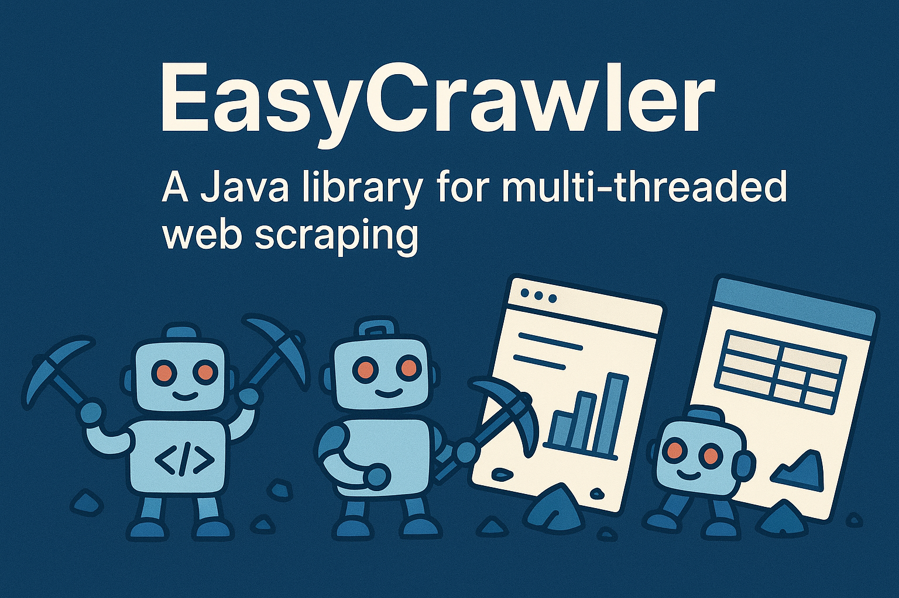

# 🚀 EasyCrawler - The Easy and Powerful Web Crawler!


## 🌟 What is EasyCrawler?

Welcome to **EasyCrawler**, the web crawler that turns web exploration into an exciting adventure! 🕷️💻

Imagine an intelligent robot that navigates the internet like a digital detective, collecting valuable information from websites with ease and efficiency. EasyCrawler is built with modern Java, using the powerful Crawler4j library, and offers a flexible and extensible architecture to meet your crawling needs.

## ✨ Amazing Features

- 🔍 **Smart Search**: Implement custom search strategies with our `SearchStrategy` interface
- 🌐 **Controlled Navigation**: Configure crawling depth, page limits, and respect for robots.txt
- 📁 **Flexible Persistence**: Save results however you want - file, database, or any destination
- ⚡ **High Performance**: Multithreading for fast and efficient crawling
- 🛡️ **Server Respect**: Politeness control to avoid overloading sites
- 🎯 **Advanced Filtering**: Ignore binary files and focus on relevant content

## 🛠️ How to Use

### Prerequisites
- Java 21 or higher
- Maven 3.6+

### Installation and Execution

1. **Clone the repository:**
   ```bash
   git clone https://github.com/your-username/EasyCrawler.git
   cd EasyCrawler
   ```

2. **Compile the project:**
   ```bash
   mvn clean compile
   ```

3. **Run the crawler:**
   ```bash
   mvn exec:java -Dexec.mainClass="org.example.Main"
   ```

### Usage Example

```java
// Configure your search strategy
SearchStrategy strategy = new TextSearchStrategy("keyword");

// Configure the persistence function
BiFunction<List<Element>, String, Void> persistFunc = (elements, url) -> {
    // Save the found elements
    System.out.println("Found at: " + url);
    elements.forEach(el -> System.out.println(el.text()));
    return null;
};

// Create the configuration
EasyCrawlerConfig config = new EasyCrawlerConfig(
    "https://example.com",
    true, // Restrict to domain
    strategy,
    persistFunc
);

// Start crawling
controller.start(new EasyCrawlerFactory(config), 8); // 8 threads
```

## 🏗️ Architecture

EasyCrawler follows the Strategy design pattern for maximum flexibility:

- **`EasyCrawler`**: The heart of the crawler, extends WebCrawler from Crawler4j
- **`SearchStrategy`**: Interface to implement different types of search
- **`EasyCrawlerConfig`**: Immutable configuration using Java Records
- **`EasyCrawlerFactory`**: Factory to create crawler instances

## 📊 Included Search Strategies

- **TextSearchStrategy**: Search for exact text in HTML elements
- **AttributeSearchStrategy**: Search for elements with specific attribute values
- **CssSelectorSearchStrategy**: Search using CSS selectors
- **RegexTextSearchStrategy**: Search for text matching a regular expression
- **PriceRangeSearchStrategy**: Search for price values within a specified range
- **XPathSearchStrategy**: Search for elements using XPath expressions
- **ClassSearchStrategy**: Search for elements with a specific class name
- **TagSearchStrategy**: Search for elements by their tag name
- *(Add your own strategies by implementing `SearchStrategy`)*

## 🤝 How to Contribute

We love contributions! 🚀

1. Fork the project
2. Create your feature branch (`git checkout -b feature/AmazingFeature`)
3. Commit your changes (`git commit -m 'Add some AmazingFeature'`)
4. Push to the branch (`git push origin feature/AmazingFeature`)
5. Open a Pull Request

### Contribution Ideas
- 🆕 New search strategies (XPath, CSS Selector, Regex)
- 🌍 Support for more data formats (JSON, XML)
- 🔄 Data export options (CSV, JSON, etc.)
- 📦 Plugin system for custom functionality
- 📊 Database integration
- 🌐 Proxy and authentication support
- 📈 Crawling metrics and dashboards
- 🧪 Automated tests

## 📋 Dependencies

- **Crawler4j 4.2**: Robust crawling engine
- **JSoup 1.19.1**: Powerful HTML parser
- **Lombok 1.18.38**: Reduces boilerplate code

## 📄 License

This project is under the MIT license - see the [LICENSE](LICENSE) file for details.

## 🎉 Let's Crawl!

Ready to explore the web like never before? EasyCrawler is here to make your data journey an amazing experience! 🌍✨

---

**Made with ❤️**

⭐ If this project helped you, give it a star on GitHub!


